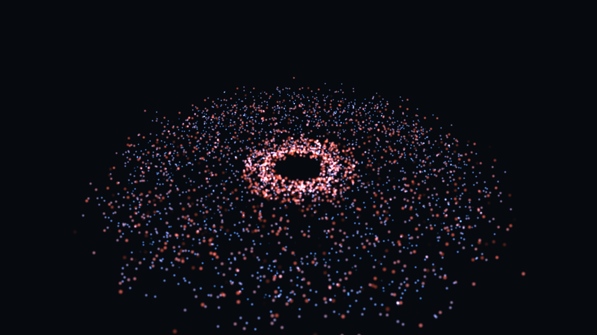
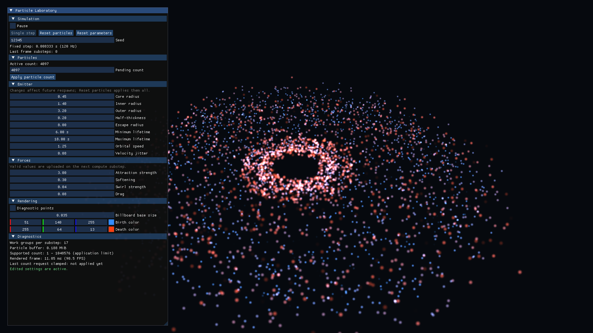
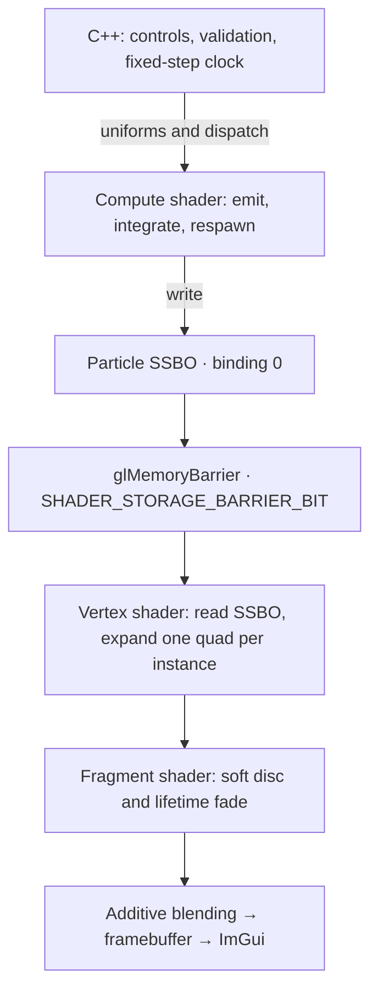

# GPU Particle Singularity

A small real-time particle laboratory built with **C++23 and OpenGL 4.6**. Particles orbit,
drift toward a central attractor, and regenerate in a continuous loop. Compute shaders handle
their entire lifecycle; instanced, camera-facing billboards turn that state into soft light.



*Captured from the current renderer with the default 4,097 particles and seed 12,345.
The control panel is omitted from this capture. [Capture details](docs/images/README.md).*

This personal graphics project explores the path from a GPU simulation to a rendered pixel,
with explicit OpenGL calls and a compact C++ codebase. The singularity is an artistic force
field, not a model of black-hole physics.

**Stack:** C++23 · OpenGL 4.6 / GLSL 4.60 · GLFW · GLAD2 · GLM · Dear ImGui · CMake · Catch2

## What it does

- **GPU particle lifecycle.** A compute shader initializes and respawns particles in an annular
  emitter, using the visible seed and a persistent random state per particle.
- **A tunable force field.** Softened central attraction, tangential swirl, and drag shape the
  motion. Particles respawn when their lifetime expires, they enter the core radius, or they
  escape the simulation bounds.
- **Stable time stepping.** Semi-implicit Euler integration runs at 120 Hz, with bounded
  catch-up work after a slow frame. Pause, single-step, and reset make the behavior inspectable.
- **Procedural soft particles.** One instanced quad per particle, a radial opacity mask, and
  lifetime-dependent color, size, and fading. Additive blending needs no particle sorting or
  image textures. A diagnostic point mode remains available.
- **Interactive controls.** Adjust the emitter, forces, particle count, palette, and size through
  Dear ImGui. Invalid edits keep the last valid settings active; count requests respect queried
  GPU limits.

## Try it

You need an **OpenGL 4.6-capable GPU and driver**, a C++23 compiler, CMake 3.25+, Ninja, and Git.
The repository uses pinned vcpkg dependencies. Windows x64 uses MSVC; Linux x64 uses GCC or Clang
with X11/XWayland. macOS is unsupported.

### Windows

Run these commands in an **x64 Visual Studio developer PowerShell** with CMake and Ninja on
`PATH`:

```powershell
git clone https://github.com/yernende/gpu-particle-singularity.git
cd gpu-particle-singularity
git clone --depth 1 --branch 2026.07.29 https://github.com/microsoft/vcpkg.git .tools/vcpkg
.\.tools\vcpkg\bootstrap-vcpkg.bat -disableMetrics
cmake --preset windows-msvc-release
cmake --build --preset windows-msvc-release
.\out\build\windows-msvc-release\gpu-particle-singularity.exe
```

### Linux

Install the [X11 build prerequisites](docs/BUILDING.md#dependencies), then:

```bash
git clone https://github.com/yernende/gpu-particle-singularity.git
cd gpu-particle-singularity
git clone --depth 1 --branch 2026.07.29 https://github.com/microsoft/vcpkg.git .tools/vcpkg
.tools/vcpkg/bootstrap-vcpkg.sh -disableMetrics
cmake --preset linux-gcc-release
cmake --build --preset linux-gcc-release
./out/build/linux-gcc-release/gpu-particle-singularity
```

See the [build and development guide](docs/BUILDING.md) for Debug builds, VS Code setup,
portable CMake/Ninja, sanitizers, and static analysis.

## Explore the laboratory

The application starts with **4,097 particles**, seed **12,345**, a fixed camera, and soft
billboard rendering. The intentionally non-round count also exercises the compute shader's
final, partially filled work group.

| Control | Behavior |
| --- | --- |
| Pause / Single step | Freeze motion or advance one 1/120-second simulation step while paused. |
| Reset particles | Re-emit the current population from the displayed seed and valid settings; preserve count and pause state. |
| Reset parameters | Restore parameter defaults while keeping the current population and active count. Apply the pending count separately. |
| Seed | Used at the next particle reset or population recreation. |
| Pending count / Apply particle count | Change the count and initialize a new buffer when the applied count differs from the active count. |
| Emitter | Tune spawn geometry, lifetime, and initial motion for future respawns. Reset particles applies them to everyone; core/escape thresholds affect existing particles. |
| Forces | Tune attraction, softening, swirl, and drag at the next simulation substep. |
| Rendering | Change billboard size and birth/death colors, or switch to diagnostic points. |
| Diagnostics | Inspect the active count, buffer size, work groups, frame rate, and validation messages. |

The panel can be moved, resized, or collapsed using its title bar to leave the scene visible.

<details>
<summary>View the control panel</summary>



</details>

## How it works



The CPU allocates the buffer and submits work; it does not update or upload an array of
particles every frame. The same SSBO is written by compute and read by the vertex shader.
Each particle occupies **48 bytes** in a `std430` layout: position + age, velocity + lifetime,
and a four-component unsigned random-state field. C++ assertions verify the 48-byte size and
member offsets.

Each compute work group has **256 invocations**. A bounds check handles the last partial group,
and each invocation owns one particle, so updates need no inter-particle synchronization.
The CPU issues `glMemoryBarrier(GL_SHADER_STORAGE_BARRIER_BIT)` after each dispatch to make
its writes visible to later SSBO accesses, including the next simulation step and rendering.

For rendering, `gl_InstanceID` selects a particle and `gl_VertexID` selects one of six quad
corners. Expanding the corners in view-space X/Y keeps the billboard facing the camera without
a mesh vertex buffer. The fragment shader supplies a soft radial mask; blending uses
`GL_SRC_ALPHA, GL_ONE`. Depth testing stays enabled and particle depth writes are disabled,
then the pass restores state before ImGui. This version has no opaque core geometry to occlude
the particles.

### Source map

| File | Responsibility |
| --- | --- |
| [main.cpp](src/main.cpp) | Context lifetime, frame loop, simulation/render order, and smoke mode. |
| [gps_demo.cpp](src/demo/gps_demo.cpp) | Embedded GLSL, compute dispatch, billboard drawing, and the control panel. |
| [particle_gpu.hpp](src/graphics/particle_gpu.hpp) | The shared CPU/GLSL layout contract. |
| [particle_buffer.cpp](src/graphics/particle_buffer.cpp) | SSBO ownership, allocation, and buffer limits. |
| [shader_program.cpp](src/graphics/shader_program.cpp) | Shader compilation, linking, and RAII ownership. |
| [fixed_step_accumulator.cpp](src/simulation/fixed_step_accumulator.cpp) | Bounded simulation stepping. |
| [particle_settings.cpp](src/simulation/particle_settings.cpp) | Parameter validation. |

## Validation

```powershell
ctest --preset windows-msvc-release
.\out\build\windows-msvc-release\gpu-particle-singularity.exe --smoke-test
```

On Linux, use `ctest --preset linux-gcc-release` and
`./out/build/linux-gcc-release/gpu-particle-singularity --smoke-test`.

The CPU suite covers settings, command-line options, fixed-step timing, and work-group math.
The smoke test creates a real OpenGL context, initializes the GPU particle state, renders three
frames, and checks OpenGL errors. It is a short rendering check, not a visual regression test
or a performance benchmark.

The current milestone was checked on **Windows / MSVC / NVIDIA GeForce RTX 3060 Ti** on
September 20, 2026: Debug and Release builds, **16/16 tests in each**, and both GPU smoke tests
passed. The screenshots were captured separately from the running simulation.

[CI](.github/workflows/ci.yml) configures Windows MSVC tests, Linux Clang ASan/UBSan tests,
and the explicit macOS rejection check. GPU smoke tests require a suitable graphics context
and are run separately from that workflow.

## Project status and scope

This repository is preserved as a **soft-billboard particle simulation milestone**: the
implementation reached Feature 7 of the original learning roadmap. The longer
[TODO](TODO.md#preserved-milestone--september-20-2026) records that stopping point and keeps the
remaining experiments available for a future revisit.

The opaque central sphere, broader GPU boundary/smoke tests, and the planned 65,536-particle
default were left for later. The current core radius affects particle capture only. There is
no N-body interaction, relativistic physics, bloom, trails, or orbit camera; the focus is the
compute-to-render pipeline and its C++/OpenGL implementation.

## License

[MIT](LICENSE) · Aleksandr Olekhnovich
